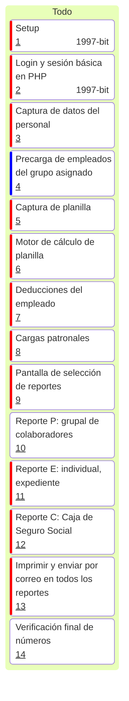

# Kanban: Proyecto Contabilidad

---

## Resumen por Épica

| Épica           | Issues                 |
| --------------- | ---------------------- |
| EP-1: Setup     | #1, #2                 |
| EP-2: Empleados | #3, #4                 |
| EP-3: Planilla  | #5, #6, #7, #8         |
| EP-4: Reportes  | #9, #10, #11, #12, #13 |
