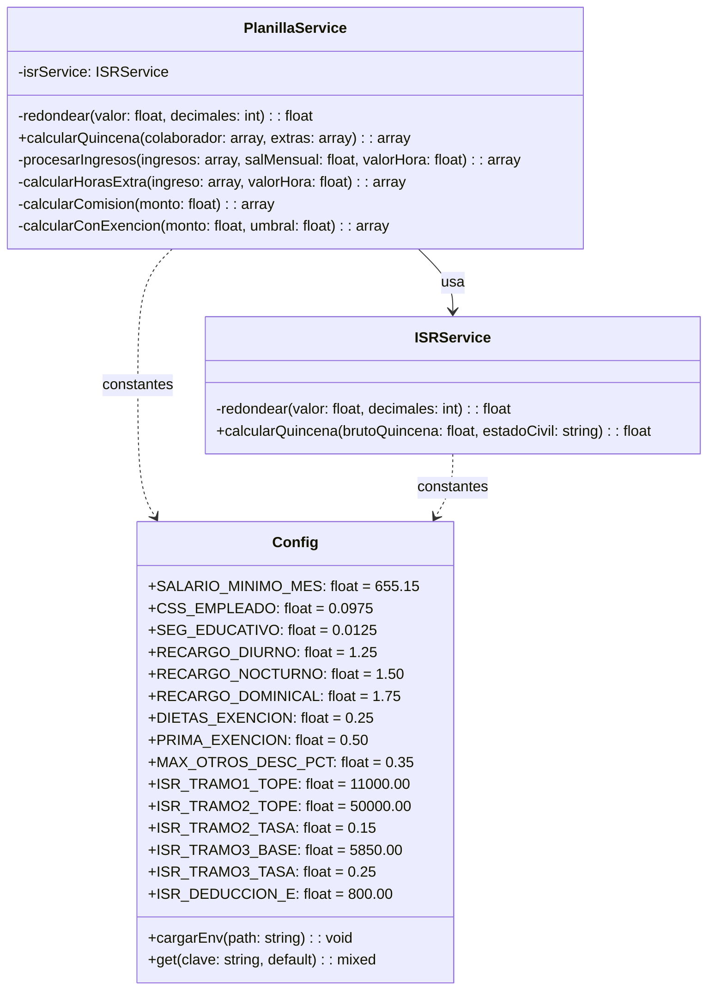
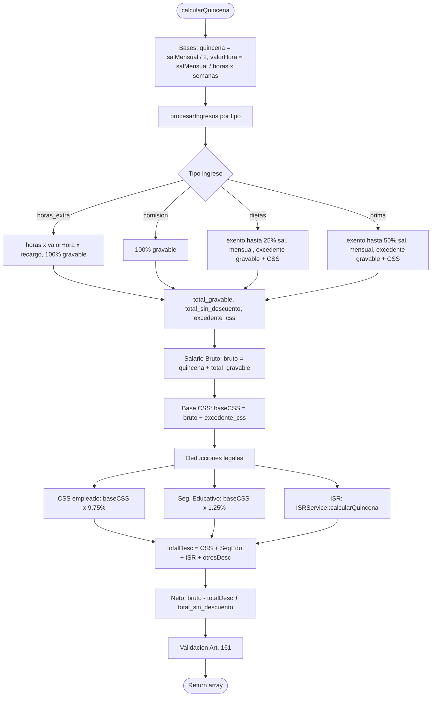

# PlanillaService — Documentación Técnica

Servicio principal de cálculo de planilla quincenal. Orquesta deducciones legales,
ingresos variables y validación del Art. 161 del Código de Trabajo de Panamá.

---

## Diagrama de clases



---

## Flujo de cálculo



---

## Tipos de ingreso

| Tipo          | Base gravable                    | Exención               | CSS aplica sobre |
| ------------- | -------------------------------- | ---------------------- | ---------------- |
| `horas_extra` | 100%                             | —                      | monto completo   |
| `comision`    | 100%                             | —                      | monto completo   |
| `dietas`      | excedente sobre 25% sal. mensual | hasta 25% sal. mensual | excedente        |
| `prima`       | excedente sobre 50% sal. mensual | hasta 50% sal. mensual | excedente        |

---

## ISR — Metodología (ISRService)

La renta anual se proyecta como:

```
rentaAnual = brutoQuincena × 2 × 13
```

> El factor `13` incorpora el décimo tercer mes en la proyección anual (24 quincenas + décimo).

### Tarifa progresiva (DGI Panamá — Art. 10, ajustado Ley 8/2010)

| Tramo | Renta anual           | Tasa                                             |
| ----- | --------------------- | ------------------------------------------------ |
| 1     | ≤ B/.11,000           | 0%                                               |
| 2     | B/.11,001 – B/.50,000 | 15% sobre excedente del tramo 1                  |
| 3     | > B/.50,000           | B/.5,850 fijos + 25% sobre excedente del tramo 2 |

El ISR anual se divide entre 24 quincenas. Para estado civil `casado` o `unido`
se aplica la deducción por cónyuge proporcionalizada:

```
deduccion = (ISR_DEDUCCION_E × ISR_TRAMO2_TASA) / 24
```

---

## Validación Art. 161 — Código de Trabajo de Panamá

> El porcentaje de descuento voluntario se calcula sobre el **salario bruto devengado**,
> **no** sobre el neto después de retenciones legales (CSS, Seg. Educativo e ISR).
> CSS, Seg. Educativo e ISR son obligaciones legales que no forman parte del cálculo
> del tope del 35%.

```php
// Correcto: base = bruto devengado
$pctDesc    = $bruto > 0 ? ($otrosDesc / $bruto) : 0;
$alertaDesc = $pctDesc > Config::MAX_OTROS_DESC_PCT; // 0.35
```

| Campo                | Descripción                                                  |
| -------------------- | ------------------------------------------------------------ |
| `otrosDesc`          | Descuentos voluntarios (mueblería, adelantos, ahorros, etc.) |
| `bruto`              | Salario bruto devengado en la quincena                       |
| `MAX_OTROS_DESC_PCT` | Tope legal = 35% (`0.35`)                                    |

---

## Contantes relevantes de Config

| Constante            | Valor    | Uso                                           |
| -------------------- | -------- | --------------------------------------------- |
| `CSS_EMPLEADO`       | `0.0975` | Retención CSS empleado (9.75%)                |
| `SEG_EDUCATIVO`      | `0.0125` | Seguro educativo empleado (1.25%)             |
| `CSS_PATRONO`        | `0.1325` | Aporte patronal CSS (no afecta neto empleado) |
| `SEG_EDUCATIVO_PAT`  | `0.015`  | Aporte patronal seg. educativo                |
| `DIETAS_EXENCION`    | `0.25`   | Umbral exención dietas (25% sal. mensual)     |
| `PRIMA_EXENCION`     | `0.50`   | Umbral exención prima (50% sal. mensual)      |
| `RECARGO_DIURNO`     | `1.25`   | Factor horas extra diurnas                    |
| `RECARGO_NOCTURNO`   | `1.50`   | Factor horas extra nocturnas                  |
| `RECARGO_DOMINICAL`  | `1.75`   | Factor horas extra dominicales                |
| `MAX_OTROS_DESC_PCT` | `0.35`   | Tope Art. 161 — descuentos voluntarios        |

---

## Return de `calcularQuincena()`

```php
[
  // Ingresos
  'salario_base_quincena'        => float,  // salMensual / 2
  'valor_hora'                   => float,  // valor hora ordinaria calculado
  'otros_ingresos'               => float,  // total ingresos gravables del período
  'otros_ingresos_sin_descuento' => float,  // total ingresos exentos (dietas/prima dentro de umbral)
  'detalle_ingresos'             => array,  // desglose por tipo de ingreso
  'salario_bruto'                => float,  // quincena + otros_ingresos

  // Deducciones
  'desc_seguro_social'           => float,  // CSS empleado
  'desc_seguro_educativo'        => float,  // Seg. Educativo empleado
  'desc_isr'                     => float,  // ISR quincenal
  'otros_descuentos'             => float,  // descuentos voluntarios
  'total_descuentos'             => float,  // suma de todas las deducciones

  // Neto
  'salario_neto'                 => float,  // bruto − total_descuentos + sin_descuento

  // Art. 161
  'alerta_desc_excede'           => bool,   // true si otrosDesc / bruto > 35%
  'pct_descuentos'               => float,  // porcentaje (0–100) de otrosDesc sobre bruto
]
```
